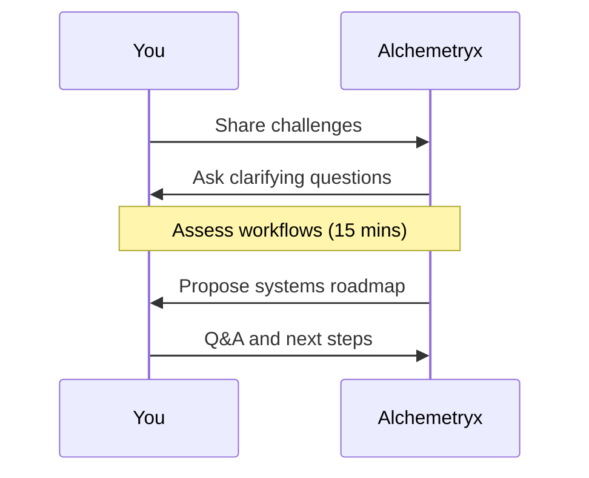

## Overview

Begin your journey with Alchemetryx by scheduling a discovery call. You identify operational pain points like scattered workflows and manual processes, and our experts design reliable systems to bring structure and control. This quickstart guides you through scheduling, preparation, expectations, and contact options.

<Callout kind="info">
Before starting, ensure you have access to your business metrics, such as monthly revenue, team size, and key workflows. This helps us provide targeted advice during the assessment.
</Callout>

## Schedule Your Discovery Call

Follow these steps to book your initial 30-minute discovery call. We use secure scheduling tools to fit your availability.

<Steps>
  <Step title="Visit Scheduling Page" icon="calendar">
    Go to our booking page at `https://calendly.com/alchemetryx/discovery`.
  </Step>
  <Step title="Select Time Slot" icon="clock">
    Choose a date and time that works for you. Slots are available Monday to Friday, `9AM-5PM EST`.
  </Step>
  <Step title="Fill Out Form" icon="edit-3">
    Provide basic details: your name, business name, and a brief description of your challenges.
  </Step>
  <Step title="Confirm and Prepare" icon="check-circle">
    You'll receive a confirmation email with call details and preparation tips.
  </Step>
</Steps>

## Prepare for Your Assessment

Gather information to make the session productive. Focus on areas where your business leaks time, money, or energy.

<Tabs>
  <Tab title="Small Business (<10 people)" icon="users">
    List your top `3` manual tasks, such as invoicing or follow-ups.
    
    Review your current tools (e.g., spreadsheets, email).
  </Tab>
  <Tab title="Mid-Sized (10-50 people)" icon="building">
    Document key workflows like sales pipelines or inventory.
    
    Note dependencies on the owner for decisions.
  </Tab>
</Tabs>

<Expandable title="Advanced Preparation Tips" default-open="false">
  Export recent financials and note recurring issues. Aim for `5-10` bullet points on growth blockers.
</Expandable>

## What to Expect in the First Engagement

Your discovery call uncovers root causes and outlines a custom plan. Here's the typical flow:



Subsequent engagements include:
- **Week 1**: Deep-dive audit.
- **Week 2-4**: System design and implementation.
- **Ongoing**: Monitoring and optimization.

<Columns cols={2}>
  <Card title="Audit Phase" icon="search" href="#audit">
    Identify leaks in operations.
  </Card>
  <Card title="Build Phase" icon="settings" href="#build">
    Deploy simple, reliable systems.
  </Card>
  <Card title="Scale Phase" icon="trending-up" href="#scale">
    Make growth predictable.
  </Card>
  <Card title="Support" icon="shield" href="/contact">
    Continuous guidance.
  </Card>
</Columns>

## Contact Methods and Response Times

Reach us via multiple channels. We respond promptly to keep your momentum going.

<CodeGroup tabs="Email,Phone,Form">
  ```text
  Email: hello@alchemetryx.com
  Subject: Discovery Call Request - [Your Business]
  Response: <24 hours
  ```
  ```text
  Phone: +1 (555) 123-4567
  Hours: 9AM-5PM EST, Mon-Fri
  Response: <2 hours during business hours
  ```
  ```text
  Web Form: https://alchemetryx.com/contact
  Fields: Name, Email, Message
  Response: <48 hours
  ```
</CodeGroup>

<Callout kind="tip">
After contacting us, check your spam folder for responses. Reference your scheduled call for faster support.
</Callout>

Ready to transform your operations? [Book now](https://calendly.com/alchemetryx/discovery) and experience structured growth.