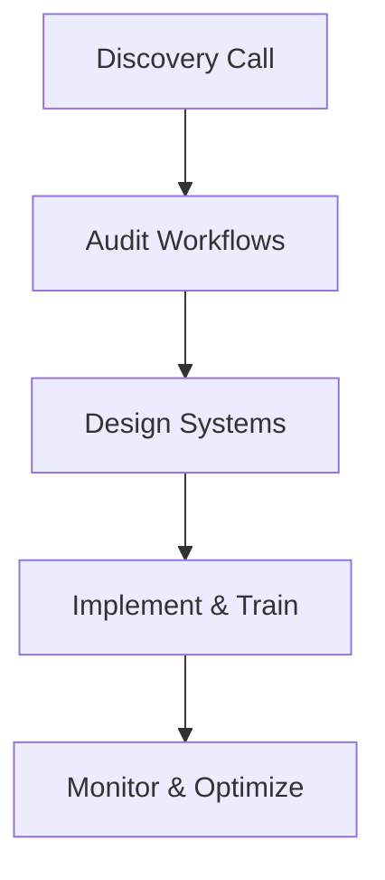

## Overview

Alchemetryx Consulting partners with owner-led small and mid-sized businesses to bring structure, clarity, and control to your operations. You fix broken workflows, reduce manual dependencies, and build simple, reliable systems that scale with your growth. Most businesses struggle not from lack of effort, but from scattered operations, manual follow-ups, finances, and decision-making overly reliant on the owner. Alchemetryx identifies leaks in time, money, and energy, then designs practical systems to eliminate chaos and make growth predictable.

<Callout kind="info">
Alchemetryx focuses on actionable systems you can implement immediately, without complex software or large teams.
</Callout>

## Key Benefits

Transform your business with these core advantages:

<Columns cols={3}>
  <Card title="Streamlined Workflows" icon="settings" href="#core-focus">
    Eliminate manual bottlenecks and automate repetitive tasks to free up your time for strategic decisions.
  </Card>
  <Card title="Clear Decision-Making" icon="trending-up" href="#core-focus">
    Gain real-time intelligence on finances and operations to make data-driven choices confidently.
  </Card>
  <Card title="Predictable Growth" icon="rocket" href="/quickstart">
    Build scalable systems that support expansion without proportional increases in chaos or costs.
  </Card>
</Columns>

## Core Focus Areas

Alchemetryx specializes in three interconnected areas. Choose your starting point below.

<Tabs>
  <Tab title="Workflows" icon="workflow">
    Fix broken processes that waste hours daily. You map current workflows, identify pain points, and implement streamlined automations.

    For example, automate client onboarding:

    ```javascript
    // Simple Zapier-like automation script (Node.js example)
    const onboardingWorkflow = async (newClient) => {
      await sendWelcomeEmail(newClient.email);
      await createProjectTask(newClient.id);
      await notifyTeam(newClient.name);
      console.log(`Onboarding complete for ${newClient.name}`);
    };
    ```

    <Callout kind="tip">
    Start with high-impact workflows like invoicing or follow-ups.
    </Callout>
  </Tab>
  <Tab title="Finances" icon="dollar-sign">
    Centralize scattered financial tracking into reliable dashboards. You gain visibility into cash flow, expenses, and profitability without spreadsheets.

    ```python
    # Python script for basic cash flow summary
    import pandas as pd

    df = pd.read_csv('transactions.csv')
    monthly_summary = df.groupby('month')['amount'].sum()
    print(monthly_summary)
    # Output: Predictable cash flow insights
    ```
  </Tab>
  <Tab title="Intelligence" icon="bar-chart-3">
    Build decision intelligence by integrating data from operations and finances. You create custom KPIs and alerts for proactive management.
  </Tab>
</Tabs>

## How We Work: The Alchemetryx Process



This 4-week cycle delivers results fast.

<Steps>
  <Step title="Book Discovery" icon="calendar">
    Schedule a 30-minute call to discuss your biggest operational pain points.
  </Step>
  <Step title="Workflow Audit" icon="search">
    We analyze your current processes and identify quick wins.
  </Step>
  <Step title="System Design" icon="tool">
    Co-create simple, reliable systems tailored to your business.
  </Step>
  <Step title="Launch & Support" icon="check-circle">
    Implement changes with hands-on training and 30 days of support.
  </Step>
</Steps>

## Next Steps

Ready to bring structure to your business?

<Columns cols={2}>
  <Card title="Book a Free Call" icon="phone" href="https://calendly.com/alchemetryx/discovery" target="_blank">
    Start with a no-obligation discovery session.
  </Card>
  <Card title="Explore Services" icon="book-open" href="/services">
    Dive into detailed service offerings and case studies.
  </Card>
</Columns>

<Expandable title="Common Questions" default-open="true">
- **How long until I see results?** Most clients report 20-30% time savings in the first month.
- **Do I need new software?** No—we optimize your existing tools first.
- **What's the investment?** Custom quotes start at `{AUD 5,000}` for foundational systems.
</Expandable>