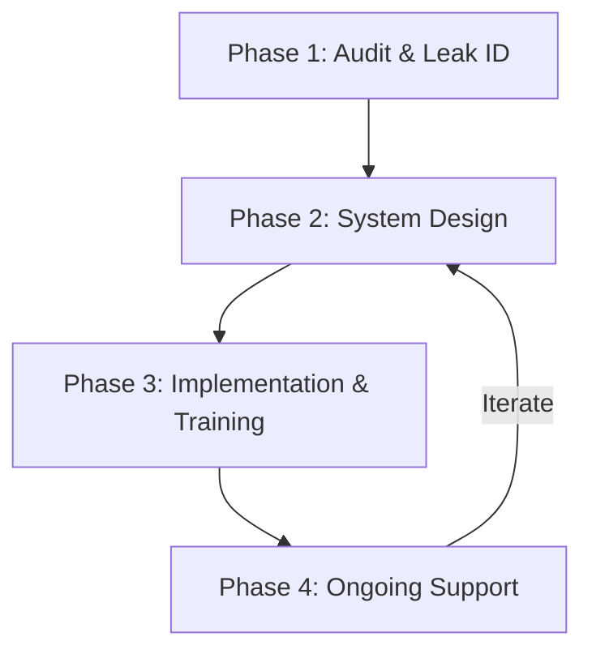

## Overview

Alchemetryx follows a proven 4-phase methodology to transform chaotic operations into reliable systems. We start by auditing your business to pinpoint leaks in time, money, and energy. Then we design simple, scalable systems tailored to your needs. Implementation includes hands-on training so your team adopts them seamlessly. Finally, we provide ongoing support to iterate and scale as you grow.

This structured approach ensures predictable results, reducing owner dependency and enabling sustainable growth.



## Phase 1: Initial Business Audit and Leak Identification

We begin with a comprehensive audit of your operations. You provide access to your tools, workflows, and data. Our team maps your current processes, identifying bottlenecks like manual data entry, scattered follow-ups, or delayed decision-making.

<Callout kind="info">
Prepare by gathering your key tools: CRM, accounting software, project management apps, and email inboxes.
</Callout>

<Steps>
  <Step title="Discovery Call" icon="phone">
    Schedule a 60-minute call to understand your goals and pain points.
  </Step>
  <Step title="Data Mapping" icon="database">
    Review your tools and workflows to visualize data flows.
  </Step>
  <Step title="Leak Report" icon="alert-triangle">
    Deliver a prioritized report of inefficiencies with estimated impact.
  </Step>
</Steps>

## Phase 2: System Design Principles

Our designs emphasize simplicity, reliability, and scalability. We avoid over-engineered solutions, focusing on systems your team can maintain without constant support.

<Columns cols={3}>
  <Card title="Simplicity First" icon="feather">
    Build with 80/20 rule: solve 80% of problems with 20% effort.
  </Card>
  <Card title="Automation Native" icon="zap">
    Automate repetitive tasks using no-code tools like Zapier or Make.
  </Card>
  <Card title="Owner Independence" icon="users">
    Design for team ownership, minimizing single points of failure.
  </Card>
</Columns>

<Expandable title="Example System Config" default-open="false">
Here's a sample workflow configuration in YAML for a lead follow-up system:

````yaml
workflows:
  lead-followup:
    trigger: new-lead-in-crm
    actions:
      - email-reminder: day-1
      - slack-notify: sales-team
      - update-status: followed-up
    conditions:
      - lead-score > 70
````
</Expandable>

## Phase 3: Implementation and Training Phases

Once designs are approved, we roll out systems in waves. You collaborate closely as we configure tools and migrate data.

<Tabs>
  <Tab title="Week 1-2: Core Setup" icon="settings">
    <Steps>
      <Step title="Tool Configuration">
        Set up integrations and automations.
      </Step>
      <Step title="Data Migration">
        Import historical data cleanly.
      </Step>
    </Steps>
  </Tab>
  <Tab title="Week 3-4: Team Training" icon="users">
    Hands-on sessions ensure adoption:

    - Live walkthroughs
    - Custom cheat sheets
    - Q&A office hours
  </Tab>
</Tabs>

## Phase 4: Ongoing Support and Iteration

Growth doesn't stop, so neither does our partnership. You receive monthly check-ins and quarterly reviews to refine systems.

<Callout kind="tip">
Most clients see 30-50% time savings in the first 90 days. Schedule your audit today to start.
</Callout>

We monitor key metrics like task completion rates and owner hours spent on ops. Adjustments are made iteratively based on your feedback and business changes.

<Columns cols={2}>
  <Card title="Monthly Check-ins" icon="calendar">
    Review metrics and tweak automations.
  </Card>
  <Card title="Scale Support" icon="trending-up">
    Expand systems as you hire or launch new products.
  </Card>
</Columns>