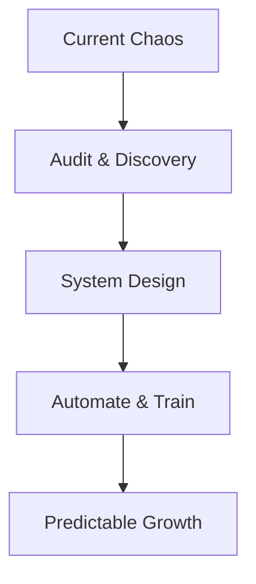

## Overview

Alchemetryx Consulting partners with growing small and mid-sized businesses to bring structure, clarity, and control to your operations. You identify where time, money, and energy leak through scattered processes—then we design practical systems that eliminate chaos and enable predictable growth. Our services focus on workflow optimization, financial intelligence, growth strategy, and custom solutions tailored for owner-led businesses.

<Callout kind="info">
  Most businesses struggle not from lack of ambition, but from manual dependencies and fragmented decision-making. We fix that.
</Callout>

## Core Services

Discover our four pillar services, each designed to address specific pain points in your operations.

<Columns cols={2}>
  <Card title="Workflow Optimization & Automation" icon="zap" href="#workflow">
    Streamline daily processes by automating repetitive tasks and fixing broken handoffs between teams.
  </Card>
  <Card title="Financial Tracking & Decision Intelligence" icon="bar-chart-3" href="#financial">
    Gain real-time visibility into cash flow, expenses, and profitability to make data-driven decisions.
  </Card>
  <Card title="Growth Strategy & System Design" icon="trending-up" href="#growth">
    Build scalable frameworks that support expansion without adding complexity or headcount.
  </Card>
  <Card title="Custom Solutions for Owner-Led Businesses" icon="settings" href="#custom">
    Personalized systems that reduce your manual involvement and empower your team.
  </Card>
</Columns>

## How We Engage

Our consulting process follows a proven four-phase approach to deliver results quickly.

<Steps>
  <Step title="Discovery" icon="search">
    Audit your current workflows, identify bottlenecks, and map pain points.
  </Step>
  <Step title="Design" icon="edit-3">
    Co-create simple, reliable systems using tools you already know.
  </Step>
  <Step title="Implementation" icon="rocket">
    Automate and deploy with hands-on support for seamless rollout.
  </Step>
  <Step title="Optimization" icon="refresh-cw">
    Monitor performance and refine for sustained growth.
  </Step>
</Steps>

## Service Deep Dives

Each service includes targeted deliverables. Choose the right one based on your biggest challenge.

<Tabs>
  <Tab title="Workflow Optimization" icon="zap">
    We analyze your tools like Google Sheets, Airtable, or CRM systems and automate data entry, notifications, and reporting.

    ```javascript
    // Example: Simple Node.js script for lead follow-up automation
    const leads = await fetchLeadsFromCRM();
    leads.forEach(lead => {
      if (daysSinceContact(lead) > 7) {
        sendEmail(lead.email, 'Follow-up Reminder');
      }
    });
    ```

    <Expandable title="Real-World Example">
      A client reduced invoice processing from 4 hours to 15 minutes using Zapier integrations between QuickBooks and email.
    </Expandable>
  </Tab>
  <Tab title="Financial Tracking" icon="dollar-sign">
    Implement dashboards in Google Data Studio or Notion for instant insights into KPIs.

    | Metric | Tool | Benefit |
    |--------|------|---------|
    | Cash Flow | Google Sheets + Apps Script | Weekly forecasts |
    | Profit Margins | Airtable | Per-project tracking |
    | Burn Rate | Custom Dashboard | Monthly alerts |

    <Callout kind="tip">
      Start with our free financial health checklist to benchmark your setup.
    </Callout>
  </Tab>
  <Tab title="Growth Strategy" icon="map">
    Design systems for hiring, customer onboarding, and sales pipelines that scale effortlessly.
  </Tab>
  <Tab title="Custom Solutions" icon="tool">
    Bespoke automations for unique needs, like inventory sync or client portal access.
  </Tab>
</Tabs>

## Next Steps

Ready to plug your operational leaks? Schedule a free 30-minute audit to uncover quick wins.



<Columns cols={3}>
  <Card title="Book Audit" icon="calendar" href="https://calendly.com/alchemetryx/audit">
    Free 30-min session
  </Card>
  <Card title="Case Studies" icon="file-text" href="#case-studies">
    See proven results
  </Card>
  <Card title="Contact Us" icon="mail" href="mailto:hello@alchemetryx.com">
    Get personalized advice
  </Card>
</Columns>